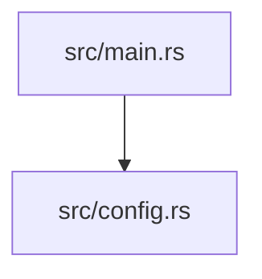

# Architecture Documentation

Generate an architecture overview for a developer joining this project.

## Sections

### 1. Technology Stack

Table with columns: Category | Technology | Version

Include: language, framework, runtime, database (omit rows that don't apply).

### 2. Directory Structure

Project tree output. Exclude: .git, node_modules, target, **pycache**, dist, build.

### 3. Module Structure

Mermaid `graph TD` diagram showing module/component relationships.
Use descriptive node IDs and quote labels containing `/` or `.`:

### 4. Data Flow

Describe the path of a typical request or operation from entry point to output.
Use a Mermaid `sequenceDiagram` if the flow involves multiple components.

Example: for a CLI tool, trace a command from argument parsing to output.
For a web app, trace an HTTP request from route handler to response.

### 5. Key Components

Table with columns: Component | Path | Description

List the main modules, entry points, and core abstractions.
Use `file_path:line_number` references in the Path column.

### 6. Dependencies

**External**: list each package/crate/library with its purpose.

**Internal**: describe how modules depend on each other.
Format: `module_a → module_b: relationship description`

## Analysis Techniques

1. **Version detection**: read language version files (`.nvmrc`, `.python-version`, `rust-toolchain.toml`, etc.) and manifest version fields
2. **Directory structure**: use Glob to map the project layout, excluding build artifacts and dependencies
3. **Code structure**: Grep for module definitions, public exports, and struct/class declarations to identify the main components
4. **Dependency enumeration**: read the project manifest file to list external dependencies and their purposes
5. **Import graph**: Grep for import/use statements to distinguish internal module dependencies from external library usage

## Writing Guidelines

- Write for a developer joining the project for the first time
- Explain "why" each component exists, not just "what" it is
- Use `file_path:line_number` references to link to source code
- Keep descriptions concise — one sentence per component
- When updating, verify each `file_path:line_number` reference is still accurate

## Omit Rules

- Omit a section only if fewer than 2 items would appear
- Never omit sections 1–4 (Technology Stack, Directory Structure, Module Structure, Data Flow)
